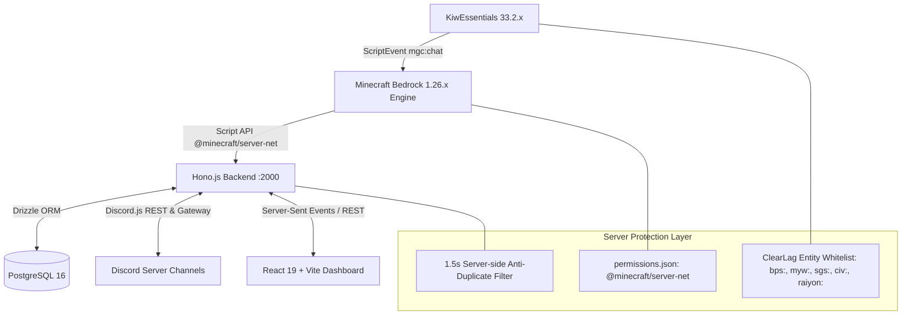

# 🎮 Magical Gaming Crew — Product Requirements Document (PRD)

## 📌 1. Product Overview & Vision

**Magical Gaming Crew (MGC) Bedrock Bridge** is an enterprise-grade, high-performance, real-time 3-way synchronization platform connecting **Minecraft Bedrock Dedicated Servers (BDS)**, **Discord Community Channels**, and a **Glassmorphic Web Dashboard**.

It provides seamless in-game chat relay, real-time player telemetry (health, armor, inventory, position, playtime), live admin management panels, leaderboard Olympic tracking, economic synchronization (KiwEssentials integration), and zero-friction 1-click server joining across all platforms (Android, iOS, iPadOS, Windows 10/11).

---

## 🎯 2. Core Target Audience & Use Cases

1. **Server Administrators & Owners**:
   - Monitor real-time server health, TPS, online players, and live coordinates without entering the game.
   - Inspect player inventories, hotbars, and offhands live to detect item duplication or illegal items.
   - Issue server commands (`/kick`, `/ban`, `/gamemode`, `/teleport`, `/give`, `/time set`) directly from a secured web panel with RBAC.
2. **Community Players**:
   - Chat in real-time between Discord channels, in-game Bedrock chat, and the web live chat without latency.
   - View live Olympic leaderboards (Kill/Death ratios, balance/coins, playtime).
   - Link Minecraft IGN to Discord accounts for verified community roles and profile badges.
3. **Content Creators & Guild Leaders**:
   - Streamline player onboarding with 1-click `minecraft://?addExternalServer=...` deep-linking.

---

## 🏗️ 3. System Architecture & Tech Stack

### Technology Matrix
- **Minecraft Script API Engine**: Bedrock 1.21.x / 1.26.x (`min_engine_version: [1, 26, 0]`).
- **Backend API**: Hono.js v4+ running on Node.js 22 LTS (TypeScript 5.3+).
- **Frontend Dashboard**: React 19, Vite 6, Tailwind/Vanilla CSS Glassmorphism, Lucide Icons.
- **Database & ORM**: PostgreSQL 16 with Drizzle ORM (schema migrations & type safety).
- **Bot Integration**: Discord.js v14 with Slash Commands, Text Commands, and Webhook dispatch.
- **Packaging**: Automated `.mcpack` and `.zip` generators for Bedrock behavior/resource packs.

---

## 🌟 4. Functional Requirements

### 4.1 Real-Time 3-Way Chat Synchronization
- **Bidirectional Zero-Latency**:
  - `Minecraft In-Game` ➔ `Discord #ingame-chat` + `Web Live Chat`.
  - `Discord` ➔ `Minecraft In-Game (/tellraw / titleraw)` + `Web Live Chat`.
  - `Web Live Chat` ➔ `Minecraft In-Game` + `Discord #ingame-chat`.
- **Anti-Duplicate Defense**:
  - ScriptEvent `mgc:chat` handles internal dispatch.
  - Server-side 1.5-second deduplication cache (`Map<string, number>`) prevents double-posting.
- **Rank & Color Preservation**:
  - Unconditionally preserves player prefixes, VIP tags, and formatted chat colors from KiwEssentials.

### 4.2 Live Player Telemetry & HUD Inspector
- **3-Second Telemetry Interval**:
  - Captures player health, max health, dimension (`overworld`, `nether`, `the_end`), and X/Y/Z coordinates.
  - Full inventory snapshot: 36 main inventory slots, 4 armor slots (helmet, chestplate, leggings, boots), offhand slot.
  - Cumulative playtime (seconds from `playtime` objective), kills, deaths, balance, and coins.
- **Security & Item Duplication Detection**:
  - Highlights forbidden items, enchanted books, and custom addon gear (Drills, Armored Elytras, Backpacks).

### 4.3 KiwEssentials Master Shop & Economy Integration
- **1,954 Addon Items across 16 Categories**:
  - Ultimate Mining Drills, Armored Elytras, Advanced Weapons, Custom Shields, Crops & Farms, Cakes & Bakes, Improved Backpacks.
- **0 Byte RAM Caching**:
  - In-memory cache TTL (5 minutes) eliminating LevelDB disk writes and startup lag.
- **ClearLag Protection**:
  - Protected prefixes (`bps:`, `myw:`, `sgs:`, `civ:`, `raiyon:`) preventing ClearLag from deleting dummy storage entities.

### 4.4 Discord Bot & Account Linking
- **Verification System**:
  - `/link <ign>` / `!link <ign>`: 4-digit code or direct linking.
  - `/top`, `/me`, `/status`, `/panel` interactive menus.
- **Real-Time Join/Leave Cards**:
  - Rich embed cards with player avatar, K/D ratio, balance, and cumulative playtime.

---

## 🔒 5. Security & RBAC Specifications

- **OSI / Bedrock Authentication**: Bearer token authorization on all `/api/game/*` endpoints (`bedrockAuthMiddleware`).
- **Web Admin Role-Based Access Control**:
  - Roles: `ADMIN`, `MODERATOR`, `MEMBER`, `GUEST`.
  - Admin Office protected by session token, IP rate-limiting, and CSRF headers.
- **Dedicated Server Security**:
  - Requirement of `permissions.json` specifying allowed modules (`@minecraft/server-net`, `@minecraft/server-admin`).

---

## 📊 6. Release Management & Versioning

- All production builds and distribution packages must reside in [`releases/`](file:///Users/ardianryan/discordmchat/releases/).
- Releases follow Semantic Versioning (`vMAJOR.MINOR.PATCH`).
- Current Stable Engine Target: **Minecraft Bedrock 1.26.45.1+** / **KiwEssentials 33.2.1+**.
