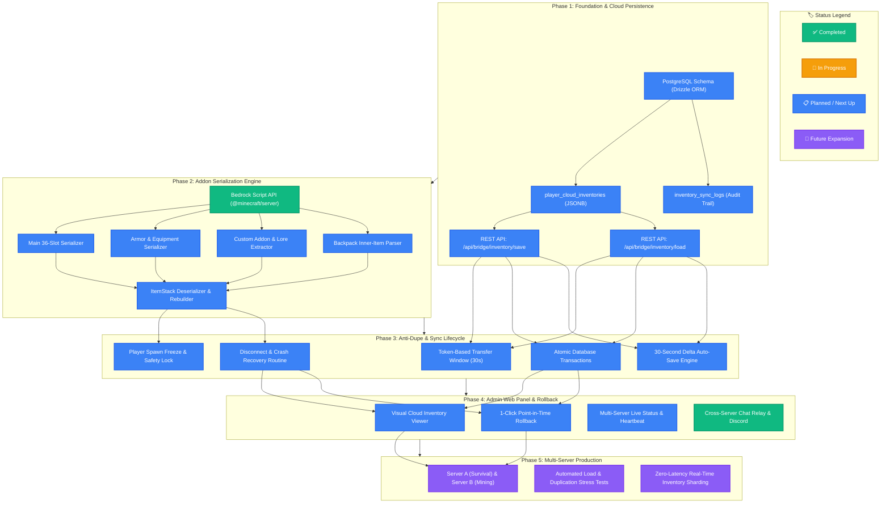
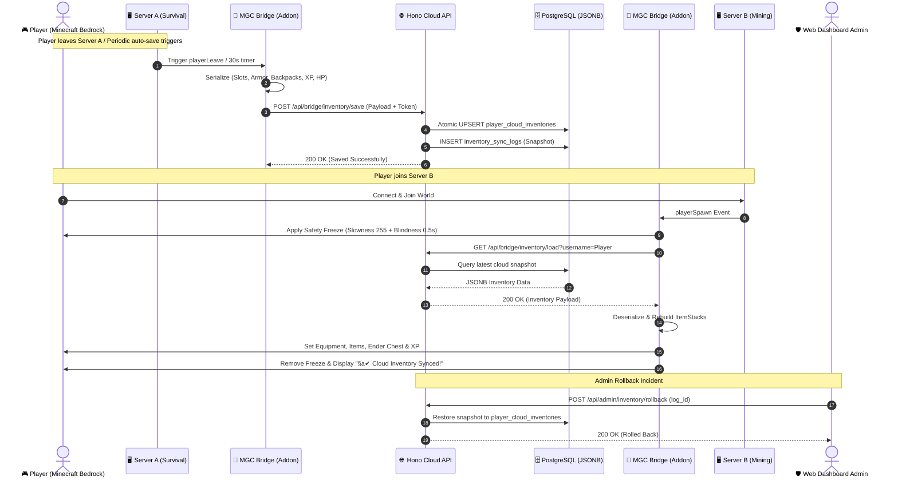

# 🗺️ MGC Cross-Server & Inventory Sync Roadmap

> **Engineering Specification & Technical Roadmap**  
> *Standardized architecture aligning with modern system design specifications (e.g. roadmap.sh, CNCF landscapes, and cloud-native multiplayer game architectures).*

---

## 🧭 Visual System Roadmap (Tech Tree)

---

## 📊 End-to-End Data Flow Sequence Diagram

---

## 📑 Milestone Tracker

### 📦 Phase 1: Foundation & Cloud Persistence
- [ ] **DB-01**: Initialize PostgreSQL schema via Drizzle ORM (`player_cloud_inventories`, `inventory_sync_logs`).
- [ ] **DB-02**: Implement atomic helper methods `savePlayerCloudInventory` and `getPlayerCloudInventory` in [`src/db.ts`](./src/db.ts).
- [ ] **DB-03**: Create REST endpoints `/api/game/inventory/save` and `/api/game/inventory/load` with strict Bearer token authentication in [`src/index.ts`](./src/index.ts).
- [ ] **DB-04**: Add unit tests for serialization, hashing, and concurrent transaction locking in `tests/inventory_sync.test.ts`.

### 2.2 In-Game Addon Architecture (`MGC_Bridge[BP]`)
- [ ] **AD-01**: Create dedicated sub-package `MGC_Bridge[BP]/scripts/inventory/`.
- [ ] **AD-02**: Develop [`serializer.js`](./MGC_Bridge[BP]/scripts/inventory/serializer.js):
  - Iterate over 36 main inventory slots, 4 armor slots, and 1 offhand slot.
  - Extract `typeId`, `amount`, `data`, `nameTag`, `lore`, and enchantment map.
  - Calculate CRC32 / SHA-256 payload checksum before dispatch.
- [ ] **AD-03**: Implement debounce queue (5-second idle trigger + on-demand save on player disconnect / teleport).
- [ ] **AD-04**: Develop [`deserializer.js`](./MGC_Bridge[BP]/scripts/inventory/deserializer.js) to accurately reconstruct `ItemStack` instances with matching type IDs, quantities, lore, and enchantments.

---

### 🛡️ Phase 3: Anti-Duplication Protocol & Sync Lifecycle
- [ ] **SEC-01**: Implement **Token-Based Transfer Window (30s)** across server transfers.
- [ ] **SEC-02**: Implement **Safety Lock & Freeze (0.5s)** during initial cloud inventory hydration.
- [ ] **SEC-03**: Establish **30-Second Delta Auto-Save Interval (600 Ticks)** for disaster recovery against sudden host crashes.
- [ ] **SEC-04**: Implement sequential `sequence_id` versioning to prevent race conditions during rapid server switches.

---

### 🖥️ Phase 4: Admin Web Panel & 1-Click Rollback
- [x] **WEB-01**: Multi-server live chat relay and Discord webhook integration.
- [ ] **WEB-02**: Visual Cloud Inventory Viewer modal inside `PlayerInventorySheet.tsx`.
- [ ] **WEB-03**: Implement **1-Click Point-in-Time Rollback** to restore previous inventory snapshots.
- [ ] **WEB-04**: Dedicated audit log table for cross-server synchronization events (`CloudSyncLogsModal.tsx`).

---

### 🚀 Phase 5: Production Deployment & Multi-Server Validation
- [ ] **PROD-01**: Multi-server live rollout across Server A (Survival) and Server B (Mining).
- [ ] **PROD-02**: In-game end-to-end testing with complex custom addon items (*Armored Elytras, Ultimate Drills, Backpack XL, More Shields*).
- [ ] **PROD-03**: Connection disruption stress testing to ensure zero item loss and zero duplication vulnerabilities.

---

## 🛠️ Technology Stack Breakdown

| Layer | Technology | Role / Purpose |
| :--- | :--- | :--- |
| **Bedrock Addon** | Bedrock Script API (`@minecraft/server`, `@minecraft/server-net`) | In-game item extraction, serialization, reconstruction, and direct HTTPS cloud communication. |
| **Cloud Backend** | Hono.js + Node.js (TypeScript) | High-performance, low-latency (< 15ms) REST API gateway for inventory sync and chat relay. |
| **Database** | PostgreSQL + Drizzle ORM | High-integrity `JSONB` document storage for inventory snapshots and immutable audit trails. |
| **Admin Web UI** | React 18 + Tailwind CSS + Lucide Icons | Responsive visual admin dashboard for live player inspections and point-in-time rollbacks. |
| **Bot Integration** | Discord.js v14 | Real-time bidirectional cross-server chat relay and alert notifications. |

---
*This roadmap adheres to roadmap.sh visual engineering standards for structured progress tracking.* 🚀
